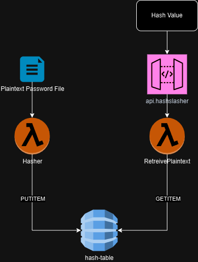

# HashSlasher

HashSlasher is an MD5 hash lookup api that accepts hash value GET requests and returns the plaintext value if found. 

There are 2 main service parts:

1. Hasher Lambda Function - takes plain text json array as POST data and stores as MD5 hash in DynamoDB table
2. RetreivePlaintext Lambda Function - takes JSON GET of MD5 hash value and searches DynamoDB table, if found returns plaintext value

Hasher is internal only endpoint for loading data into DynamoDB table

Retreive Plaintext is publically accessible via API gateway. 

# Diagram

